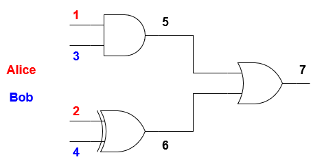

# Secure Multi-Party Computation

## Contents
* [Introduction](#introduction)
* [Installation](#installation)
* [Usage](#usage)
* [Architecture](#architecture)
* [JSON circuit](#json-circuit)
* [Example](#example)
* [Authors](#authors)

## Introduction
This project implements a
[two-party secure function evaluation](https://en.wikipedia.org/wiki/Secure_two-party_computation)
using
[Yao's garbled circuit](https://en.wikipedia.org/wiki/Garbled_circuit)
protocol. It has been started on November 2018 for the Privacy Engineering
course of Imperial College London (CO408) and refactored on November 2020.

In our model, two parties Alice and Bob compute a function on their inputs
without sharing the value of their inputs with the opposing party. Alice is
the circuit creator (the *garbler*) while Bob is the circuit evaluator. Alice
creates the yao circuit and sends it to Bob along with her encrypted inputs.
Bob then computes the results and sends them back to Alice.

## Installation
Code is written for **Python 3.6+**. Dependencies are:
* **ZeroMQ** for communications
* **Fernet** for encryption of garbled tables
* **SymPy** for prime number manipulation

Install all dependencies:
```sh
pip3 install --user pyzmq cryptography sympy
```

Clone this repository wherever you want and follow the instructions in next
section.

## Usage

#### Over the network
1. By default all tests are done on the local network.
  You can edit the network informations in **util.py**.
2. Run the server (Bob): `make bob`.
3. In another terminal, run the client (Alice) with one of the json circuit
  in *circuits/*: `make <circuit-name>` e.g. `make bool`. You can also run
  `make alice` to evaluate all circuits in *circuits/* at once.

Alice will print the truth table of the circuit for all combination of
Alice-Bob inputs. Alice does not know Bob's inputs but for the purpose of
printing the truth table only, Alice assumes that Bob's inputs follow a
specific order.

The Makefile contains the most useful commands, but you can also directly use
the script:
```sh
./main.py bob  # Run Bob side
./main.py alice -c <circuit.json>  # Run Alice side
./main.py -h  # See all available options
```

#### Local tests
To print the truth table of a circuit:
```sh
./main.py local -c <circuit.json>
```

To print a clear representation of the garbled tables of a circuit:
```sh
./main.py local -c <circuit.json> -m table
```

## Architecture
The project is composed of 4 python files:
* **main.py** implements Alice side, Bob side and local tests.
* **yao.py** implements:
    * Encryption and decryption functions.
    * Evaluation function used by Bob to get the results of a yao circuit
    * `GarbledCircuit` class which generates the keys, p-bits and garbled
      gates of the circuit.
    * `GarbledGate` class which generates the garbled table of a gate.
* **ot.py** implements the oblivious transfer protocol.
* **util.py** implements many functions related to network communications and
  asymmetric key generation.

A few functions converted to boolean circuits are provided in **circuits/**.

## JSON circuit
A function is represented as a boolean circuit using available gates:
* NOT (1-input gate)
* AND
* OR
* XOR
* NAND
* NOR
* NXOR

A few assumptions are made:
* Bob knows the boolean representation of the function. Thus the principle of
  "No security through obscurity" is respected.
* All gates have one or two inputs and only one output.
* The outputs of lower numbered gates will always be wired to higher numbered
  gates and/or be defined as circuit outputs.
* The gate id is the id of the gate's output.

## Example


Here is the json representation of above circuit:
```json
{
  "name": "smart",
  "circuits": [
    {
      "id": "Smart",
      "alice": [1, 2],
      "bob": [3, 4],
      "out": [7],
      "gates": [
        {"id": 5, "type": "AND", "in": [1, 3]},
        {"id": 6, "type": "XOR", "in": [2, 4]},
        {"id": 7, "type": "OR", "in": [5, 6]}
      ]
    }
  ]
}
```

Here is the truth table of the previous json circuit:
```sh
$ ./main.py local -c circuits/smart.json
======== Smart ========
  Alice[1, 2] = 0 0 Bob[3, 4] = 0 0  Outputs[7] = 0
  Alice[1, 2] = 0 0 Bob[3, 4] = 0 1  Outputs[7] = 1
  Alice[1, 2] = 0 0 Bob[3, 4] = 1 0  Outputs[7] = 0
  Alice[1, 2] = 0 0 Bob[3, 4] = 1 1  Outputs[7] = 1
  Alice[1, 2] = 0 1 Bob[3, 4] = 0 0  Outputs[7] = 1
  Alice[1, 2] = 0 1 Bob[3, 4] = 0 1  Outputs[7] = 0
  Alice[1, 2] = 0 1 Bob[3, 4] = 1 0  Outputs[7] = 1
  Alice[1, 2] = 0 1 Bob[3, 4] = 1 1  Outputs[7] = 0
  Alice[1, 2] = 1 0 Bob[3, 4] = 0 0  Outputs[7] = 0
  Alice[1, 2] = 1 0 Bob[3, 4] = 0 1  Outputs[7] = 1
  Alice[1, 2] = 1 0 Bob[3, 4] = 1 0  Outputs[7] = 1
  Alice[1, 2] = 1 0 Bob[3, 4] = 1 1  Outputs[7] = 1
  Alice[1, 2] = 1 1 Bob[3, 4] = 0 0  Outputs[7] = 1
  Alice[1, 2] = 1 1 Bob[3, 4] = 0 1  Outputs[7] = 0
  Alice[1, 2] = 1 1 Bob[3, 4] = 1 0  Outputs[7] = 1
  Alice[1, 2] = 1 1 Bob[3, 4] = 1 1  Outputs[7] = 1
```

And here is the clear representation of the garbled gates:
```sh
$ ./main.py local -c circuits/smart.json -m table
======== Smart ========
P-BITS: {1: 0, 2: 1, 3: 0, 4: 0, 5: 1, 6: 0, 7: 0}
GATE: 5, TYPE: AND
[0, 0]: [1, 0][3, 0]([5, 0], 1)
[0, 1]: [1, 0][3, 1]([5, 0], 1)
[1, 0]: [1, 1][3, 0]([5, 0], 1)
[1, 1]: [1, 1][3, 1]([5, 1], 0)
GATE: 6, TYPE: XOR
[0, 0]: [2, 1][4, 0]([6, 1], 1)
[0, 1]: [2, 1][4, 1]([6, 0], 0)
[1, 0]: [2, 0][4, 0]([6, 0], 0)
[1, 1]: [2, 0][4, 1]([6, 1], 1)
GATE: 7, TYPE: OR
[0, 0]: [5, 1][6, 0]([7, 1], 1)
[0, 1]: [5, 1][6, 1]([7, 1], 1)
[1, 0]: [5, 0][6, 0]([7, 0], 0)
[1, 1]: [5, 0][6, 1]([7, 1], 1)
```

## Authors
* Olivier Roques: <olivier@oroques.dev>
* Emmanuelle Risson: <ear3218@imperial.ac.uk>
